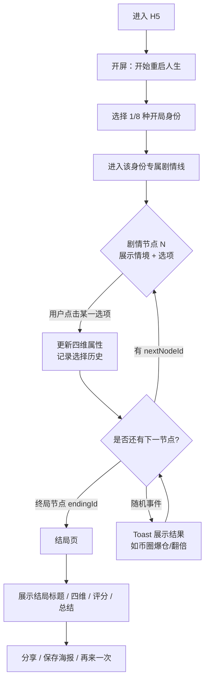
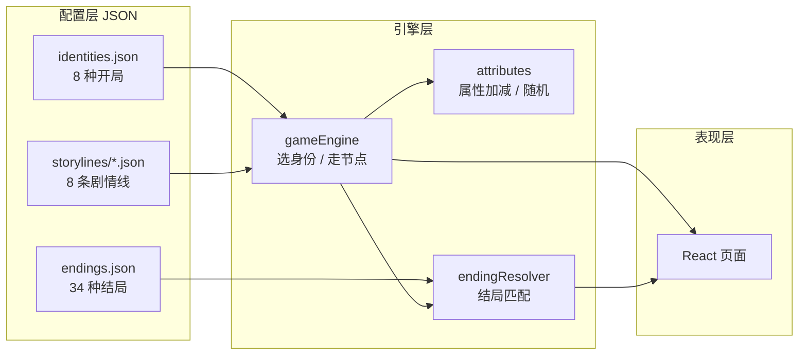
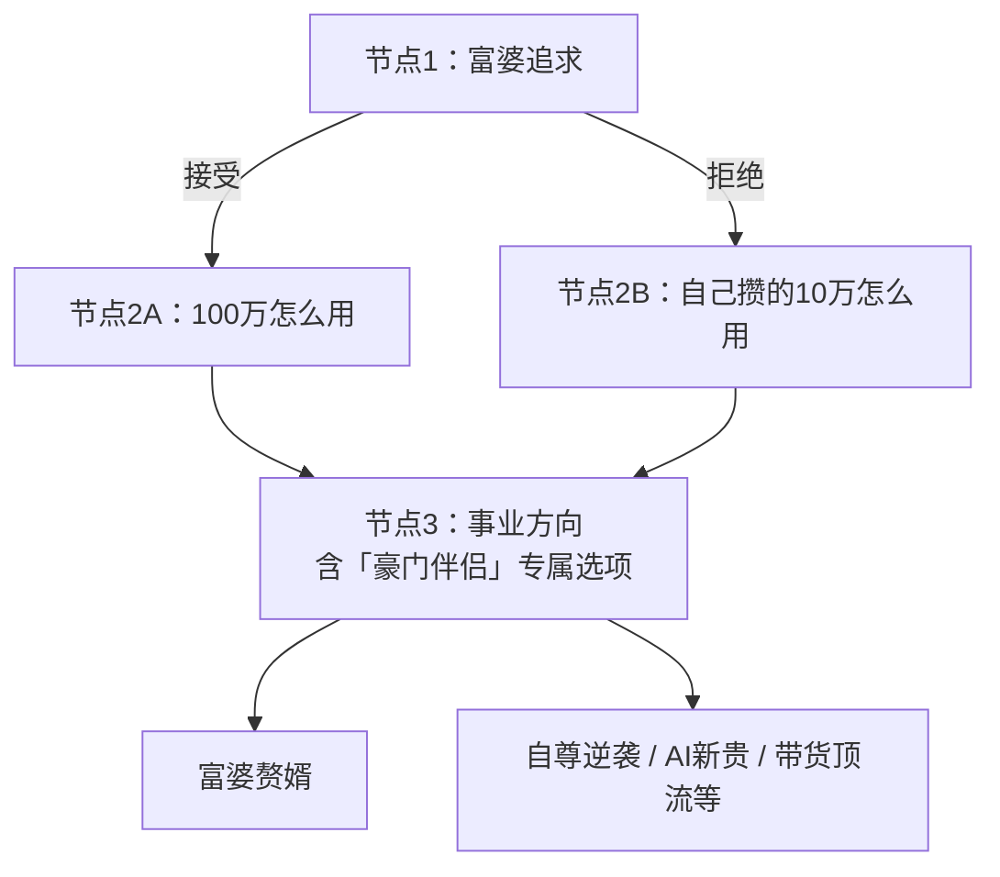
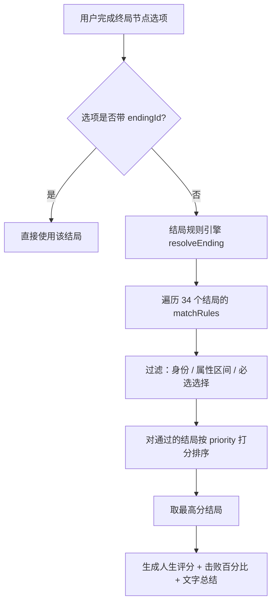

# 人生重启计划 · 产品逻辑说明

> 线上演示：https://lx-meteors.github.io/life-restart-h5/  
> 本文档说明：**整体流程、分支结构、结局如何计算**。便于评审，不替代实际体验。

---

## 一、整体流程图（用户视角）



---

## 二、产品逻辑架构图（系统视角）



**设计原则（PRD）：**

- 剧情全部由 **JSON 配置驱动**，改文案/分支不用改核心代码。
- **不是**「每题独立随机」，而是 **有向图**：选项 → `nextNodeId` 决定下一节点。
- **反差机制**：同一开局可走向逆袭或跌落（如天胡开局可「上市富豪」也可「豪门跌落」）。

---

## 三、有多少条分支？怎么触发？

### 3.1 宏观结构

| 层级 | 数量 | 触发方式 |
|------|------|----------|
| 开局身份 | **8 条** 互斥人生线 | 用户首屏选 1 个，进入对应 `startNodeId` |
| 每条线剧情节点 | **3～4 个** 关键节点 | 按顺序或按选项跳转到不同 `nextNodeId` |
| 单节点选项 | 通常 **3～4 个** | 用户点击；部分选项带条件显示 |
| 结局池 | **34 种** | 终局选项直出，或规则引擎匹配 |

### 3.2 分支类型（技术实现）

| 类型 | 说明 | 示例 |
|------|------|------|
| **路径分叉** | 选项指向不同 `nextNodeId`，后续节点文案/选项不同 | 屌丝线：接受富婆 → `ud-n2a`；拒绝 → `ud-n2b` |
| **条件选项** | 终局根据历史选择显示/隐藏选项 | 仅「接受过富婆」才出现「豪门伴侣」结局项 |
| **属性门槛** | 结局匹配时要求财富/事业等 ≥ 或 ≤ 某值 | 「财富自由」需 wealth ≥ 85 |
| **必选选择** | 结局匹配要求历史中包含某 `choiceId` | 「富婆赘婿」需选过 `ud-accept-rich` |
| **随机分支** | 同一选项按概率不同属性结果 | 币圈：45% 爆仓 / 55% 翻倍 |

### 3.3 典型分支示意：屌丝逆袭线（反差最强的一条）



### 3.4 八条人生线一览

| 身份 | 节点数 | 核心分叉点 | 可触达结局举例 |
|------|--------|------------|----------------|
| 家道中落 | 4 | 高考 → 10万用法 → 创业是否 All in → 35岁转型 | AI新贵 / 房奴 / 体制上岸 / 躺平 |
| 屌丝逆袭 | 3 | **富婆接受/拒绝** → 资金用法 → 事业终局 | 富婆赘婿 / 自尊逆袭 / 币圈传奇 |
| 天胡开局 | 3 | 留学/接班/创业 → 危机应对 → 是否上市 | 上市富豪 / 豪门跌落 / 继承帝国 |
| 学霸人生 | 4 | 保研/大厂/创业 → AI浪潮 → 同学会心态 → 终局 | 学术大牛 / 学霸陨落 / AI新贵 |
| 打工人 | 4 | 996/平衡/副业 → 买房赌上市 → 35岁转型 | 打工皇帝 / 副业自由 / 过劳 |
| 网红 | 4 | 变现策略 → 带货/精品 → 塌房应对 → 终局 | 塌房网红 / 带货顶流 / 幕后老板 |
| 恋爱脑 | 4 | 异地/分手 → 出轨 → 结婚压力 → 终局 | 爱情赢家 / 情场失意 |
| AI创业 | 4 | 产品/融资/合伙 → 成本危机 → Agent → 终局 | 独角兽 / 泡沫破裂 / 财富自由 |

**粗算路径规模：** 每条线 3～4 步，每步约 3 选项 → 单线理论组合约 **27～81 种走法**；八线合计 **数百种选择序列**（非每条都通向不同结局，结局由规则收敛到 34 种）。

---

## 四、结局怎么计算？

### 4.1 流程



### 4.2 四维属性

| 属性 | 范围 | 作用 |
|------|------|------|
| 财富 wealth | 0～100 | 选项 `delta` 累加，开局各身份初始值不同 |
| 事业 career | 0～100 | 同上 |
| 爱情 love | 0～100 | 同上 |
| 快乐 happiness | 0～100 | 同上 |

每次选择：`新属性 = clamp(旧属性 + delta, 0, 100)`。

### 4.3 结局匹配规则（endings.json）

每个结局包含 `matchRules`：

```json
{
  "priority": 90,
  "identityIds": ["underdog"],
  "requiredChoices": ["ud-accept-rich"],
  "minAttributes": { "wealth": 70 },
  "maxAttributes": { "happiness": 55 }
}
```

| 字段 | 含义 |
|------|------|
| `priority` | 多个结局同时满足时，分数越高越优先 |
| `identityIds` | 限定开局（可选） |
| `requiredChoices` | 必须选过的选项 id |
| `minAttributes` / `maxAttributes` | 四维门槛 |

**人生评分**（结果页展示）：

`评分 = 财富×30% + 事业×25% + 爱情×20% + 快乐×25%`（四舍五入）

**击败百分比**：由评分映射到约 61%～99%（带轻微波动，增强分享感）。

### 4.4 随机事件（如币圈）

选项配置 `randomOutcomes`：`chance` 为权重，命中后应用对应 `delta`，并将结果写入选择历史（影响后续结局匹配）。

---

## 五、数据与埋点

| 事件 | 时机 |
|------|------|
| game_start | 点击开始 |
| identity_select | 选定开局 |
| story_choice | 每次剧情选择 |
| game_complete | 进入结局页 |
| share_click | 点击分享 |

---

## 六、当前版本说明 & 迭代方向（回应评审意见）

老板与同事反馈中，以下点**成立**，计划在 v1.1 优化：

| 反馈 | 现状 | 优化方向 |
|------|------|----------|
| 「像选择题，看不出多条线」 | 分支在 JSON 里存在，但 UI 未展示「你正在哪条支路」 | 增加路线提示 / 关键选择回顾 |
| 「选项缺乏矛盾，太机械」 | 部分题为「All in / 不 All in」类二元题 | 改为 **双优各劣** 式（如体制内 20 万稳定 vs 体制外 50 万高压） |
| 「看不出产品逻辑」 | 仅 H5 链接 | 本文档 + 可选后台剧情树预览 |

**选项设计原则（v1.1）：**

- 避免「明显正确答案」（如 2 万 vs 100 万）。
- 每个选项至少 **+1 维 / -1 维** 的权衡，让玩家感到「选哪边都亏也都不亏」。

---

## 七、配置文件位置（研发扩展）

```
src/data/identities.json      # 开局
src/data/storylines/*.json    # 各线节点与选项
src/data/endings.json         # 结局与匹配规则
src/engine/gameEngine.ts      # 分支跳转
src/engine/endingResolver.ts  # 结局计算
```

---

*文档版本：v1.0 · 与线上一致*
